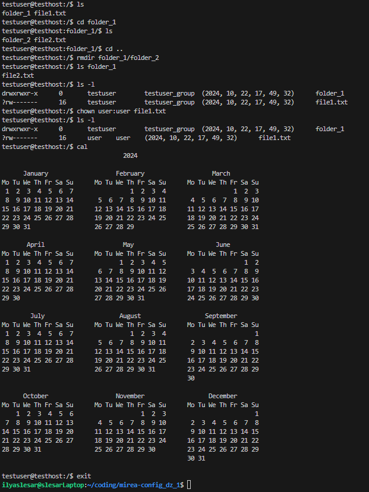
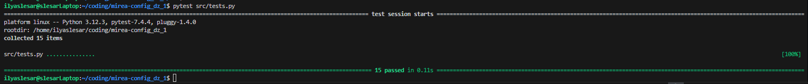

# ShellEmulator
### Общее описание
Это эмулятор sh-подобной командной строки в файловой системе .zip архива.
### Описание всех функций и настроек
В этом эмуляторе доступны следующие команды:
- ls \[-l\] <папка>
  
  Перечисление всех файлов и папок в указанной папке или текущей папке
- cd <папка>
  
  Переход в указанную папку
- exit
  
  Выход из эмулятора
- rmdir <папка>
  
  Удалить пустую папку
- chown <пользователь>:<группа> <файл/папка>

  Изменить пользователя и группу обладающие файлом
- cal
  
  Вывести календарь
- exit

  Выйти и закрыть

### Описание команд для сборки проекта
Проект не требует сборки. Для запуска проекта требуется Python 3.
Чтобы запустить проект перейдите в папку проекта и запустите ShellEmulator.py

```
git clone https://github.com/IlyaSlesar/mirea-config_dz_1.git
cd mirea-config_dz_1
python3 src/ShellEmulator.py
```

### Примеры использования в виде скриншотов


### Результаты прогона тестов
